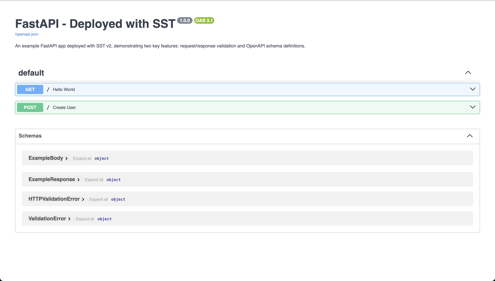

# Table of Contents

- [What is this?](#what-is-this)
- [Why would I want to do this?](#why-would-i-want-to-do-this)
- [Some of the important concepts you'd have to consider to deploy a web application](#some-of-the-important-concepts-youd-have-to-consider-to-deploy-a-web-application)
- [Other benefits of using SST](#other-benefits-of-using-sst)
- [How to run](#how-to-run)
- [How to deploy](#how-to-deploy)
- [Disclaimer](#disclaimer)

# What is this?

This is a close to minimal example of how to run locally and how to deploy a [FastAPI](https://fastapi.tiangolo.com/) application with [SST v2](https://sst.dev/).

This repository also includes insights on why using SST for FastAPI deployments could be advantageous.

# Why would I want to do this?

You might be overwhelmed by the numerous ways to deploy Python web applications. SST offers a free, open-source solution that's both easy to use and feature-rich. It simplifies serverless deployments, provides local development tools, and integrates well with AWS services.

# Some of the important concepts you have to consider to deploy a web application

[ref: https://fastapi.tiangolo.com/deployment/concepts/](https://fastapi.tiangolo.com/deployment/concepts/)

- Security - HTTPS
- Running on startup
- Restarts
- Replication (the number of processes running)
- Memory
- Previous steps before starting

Let's go over these concepts and how SST can help us:

## HTTPS

- HTTPS is handled for you. You are also provided a very straightforward way to set up custom domains: [https://docs.sst.dev/custom-domains](https://docs.sst.dev/custom-domains)

## Running on startup, Restarts, Replication, Memory

- Running on startup, Restarts, Replication, and Memory management are all handled automatically by AWS Lambda and can be fine-tuned in SST through your `Api` or `Function` construct configurations. Lambda provides built-in logging and monitoring, integrating seamlessly with Amazon CloudWatch, CloudWatch Logs, and AWS CloudTrail. For a comprehensive understanding of these features and how to leverage them effectively, I recommend exploring "AWS Lambda: The Ultimate Guide" available at [https://www.serverless.com/aws-lambda](https://www.serverless.com/aws-lambda).

## Previous steps before starting

- SST provides a [CLI](https://docs.sst.dev/packages/sst) for setting up reliable CI/CD pipelines. This includes commands for:
  - Managing secrets securely
  - Validating configurations through typechecking
  - Deploying your application to specific AWS accounts, regions, and stages
- These tools streamline the deployment process, ensuring consistency and reliability across different environments.
- For more advanced CI/CD setups, SST integrates well with popular CI/CD platforms like GitHub Actions, GitLab CI, and AWS CodePipeline.

# Other benefits of using SST

## Local Development Environment

- SST features a local development environment that lets you debug and test your Lambda functions locally.

## Infrastructure as Code (IaC)

- Infrastructure as Code (IaC) allows you to manage and provision cloud resources through code. To learn more about IaC, see: (https://aws.amazon.com/what-is/iac/)[https://aws.amazon.com/what-is/iac/].

## Progressive Disclosure

- SST's constructs are based on the idea of progressive disclosure. This means that the basic configuration for these constructs is simple, easy to understand, and readable. While this example uses a single construct, SST allows you to define and connect multiple infrastructure resources. You can learn more about managing complex infrastructures and their permissions in the official SST documentation on [Resource Binding](https://docs.sst.dev/resource-binding).

## Cost-Effective

- Cost-Effective: Leveraging serverless architecture, SST allows you to pay only for the resources you actually use. This can lead to significant cost savings, especially for applications with variable traffic.

## Reduced Operational Overhead

- Reduced Operational Overhead: With SST and serverless, you can focus more on developing your application and less on managing infrastructure, leading to increased productivity.

# How to run:

## Prerequisites

- Node.js
- Python
- poetry
- npm
- pnpm
- AWS account (with credentials configured in your environment. For setup instructions, please consult [Configure the AWS CLI](https://docs.aws.amazon.com/cli/latest/userguide/cli-chap-configure.html))

After you've installed all the prerequisites, follow these steps to set up and start your local development environment:

1. Install npm dependencies:

   ```
   pnpm install
   ```

2. Install `/app`'s Python dependencies with poetry:

   - Detailed steps: [`/app/README.md`](/app/README.md)

3. Start the local development server:
   ```
   pnpm dev
   ```

This will initialize your SST development environment, allowing you to test and debug your FastAPI application locally before deployment.

After your local development environment has been deployed, you will see an `ApiEndpoint` output in your terminal. Follow this link to view your application running locally. If you navigate to the `/docs` endpoint, you will see the Swagger UI for your application, which provides interactive documentation for your API.



# How to deploy

To deploy your application to AWS you can simply run:

```
pnpm sst deploy --stage <YOUR_STAGE_NAME>
```

You can also find a close to minimal example of a deployment workflow in the [production.yaml](.github/workflows/production.yaml) file within this repository. This file demonstrates a basic GitHub Actions setup for deploying the application to AWS using SST.

# Disclaimer

I haven't used this exact setup in production yet. However, I've had some really awesome experiences using SST for TypeScript projects. So while I can't vouch for this specific configuration in a production environment, I'm pretty excited about its potential! :P

If you have experience deploying Python web applications, you may be interested in contributing to research on FastAPI cloud deployments. The creator of FastAPI, @[tiangolo](https://github.com/tiangolo), is conducting a [survey](https://docs.google.com/forms/d/e/1FAIpQLSfGQPYCZi5M4XVLc49QnOJn3biiiMv5f9l0Llv4d9bOGozgRw/viewform) to gather insights on how developers are deploying FastAPI applications to the cloud.
